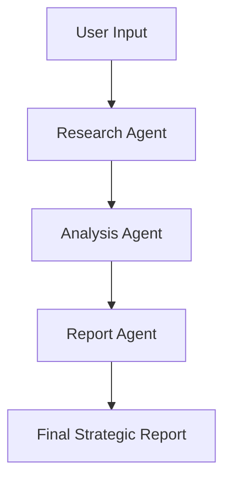

# Competitor-Analysis-Agent
Business Consultant Agent using CrewAI
# AI-Powered Competitor Analysis System

An intelligent multi-agent competitor analysis platform built with Streamlit, CrewAI, and OpenAI. This system automates competitor research, market analysis, SWOT assessment, and strategic recommendation generation using specialized AI agents.

---

## 🚀 Overview

The Competitor Analysis System helps businesses quickly generate deep competitive intelligence reports by orchestrating multiple AI agents with clearly defined responsibilities.

The platform:
- Identifies and researches competitors
- Collects pricing, feature, and review data
- Performs SWOT and market positioning analysis
- Generates executive-ready strategic reports
- Exports findings as PDF or text reports

---

## 🧠 Multi-Agent Architecture

The system uses three specialized AI agents powered by CrewAI.

### 1. Research Agent 🔎
Responsible for:
- Competitor discovery
- Market research
- Pricing analysis
- Customer review collection
- Company information gathering

**Tools Used**
- Competitor Search Tool
- Company Info Tool
- Pricing Search Tool
- Review Search Tool

---

### 2. Analysis Agent 📊
Responsible for:
- SWOT analysis
- Competitive benchmarking
- Trend analysis
- Market positioning analysis
- Opportunity/threat detection

**Tools Used**
- Data Processor Tool

---

### 3. Report Agent 📝
Responsible for:
- Strategic synthesis
- Executive summaries
- Recommendations
- Final report generation

---

# ✨ Features

- ✅ AI-powered competitor discovery
- ✅ Automated SWOT analysis
- ✅ Competitive comparison matrices
- ✅ Strategic recommendations
- ✅ PDF report export
- ✅ Interactive Streamlit dashboard
- ✅ Configurable analysis depth
- ✅ Multi-agent orchestration
- ✅ Real-time progress tracking
- ✅ Session state management

---

# 🏗️ Tech Stack

| Technology | Purpose |
|---|---|
| Streamlit | Frontend UI |
| CrewAI | Multi-agent orchestration |
| LangChain | LLM integrations |
| OpenAI | AI reasoning and generation |
| SerpAPI | Search and web intelligence |
| Python | Backend development |

---

# 📂 Project Structure

```bash
competitor-analysis-system/
│
├── app.py                  # Main Streamlit application
├── agents.py               # Agent definitions
├── tasks.py                # CrewAI task definitions
├── tools.py                # External search/data tools
├── utils.py                # Utility functions
├── config.py               # Configuration settings
├── requirements.txt
├── .env
│
├── reports/                # Generated reports
└── README.md
```

---

# ⚙️ Installation

## 1. Clone the Repository

```bash
git clone https://github.com/your-username/competitor-analysis-system.git
cd competitor-analysis-system
```

---

## 2. Create Virtual Environment

```bash
python -m venv venv
```

Activate the environment:

### Mac/Linux
```bash
source venv/bin/activate
```

### Windows
```bash
venv\Scripts\activate
```

---

## 3. Install Dependencies

```bash
pip install -r requirements.txt
```

---

# 🔑 Environment Variables

Create a `.env` file in the root directory.

```env
OPENAI_API_KEY=your_openai_api_key
SERPAPI_API_KEY=your_serpapi_api_key
```

---

# ▶️ Running the Application

Start the Streamlit app:

```bash
streamlit run app.py
```

The app will open at:

```bash
http://localhost:8501
```

---

# 📋 Usage

## Step 1: Enter Company Information
Provide:
- Company name
- Industry

Example:
- Slack
- SaaS

---

## Step 2: Configure Analysis

Select:
- Number of competitors
- Analysis depth
  - Quick
  - Standard
  - Deep

---

## Step 3: Run Analysis

Click:

```bash
🚀 Start Analysis
```

The system will:
1. Initialize AI agents
2. Create tasks
3. Assemble the CrewAI workflow
4. Execute research and analysis
5. Generate the final report

---

# 📊 Output

The platform generates:
- Executive summary
- Competitor profiles
- SWOT analysis
- Competitor comparison matrix
- Strategic recommendations
- Threat and opportunity assessment

---

# 📥 Export Options

Users can export:
- PDF reports
- Plain text reports

---

# 🧩 Core Workflow



---

# 🛠️ Key Components

## `app.py`
Main Streamlit application:
- UI rendering
- Session state management
- Workflow execution
- Progress tracking
- Report visualization

---

## `agents.py`
Defines:
- Research Agent
- Analysis Agent
- Report Agent

Each agent has:
- Role
- Goal
- Backstory
- Tools
- Memory
- LLM configuration

---

## `tasks.py`
Defines CrewAI task orchestration:
- Research tasks
- Analysis tasks
- Reporting tasks

---

## `utils.py`
Utility functions:
- PDF generation
- Report formatting
- Metric extraction
- Filename generation

---

# 🔄 Analysis Pipeline

```python
1. Initialize Agents
2. Create Tasks
3. Assemble Crew
4. Execute Sequential Workflow
5. Generate Insights
6. Render Dashboard
7. Export Reports
```

---

# 🧪 Example Use Cases

## SaaS Competitive Intelligence
Analyze:
- Slack vs Microsoft Teams
- Notion vs Confluence
- Shopify vs BigCommerce

---

## E-Commerce Market Research
Compare:
- Pricing models
- Customer reviews
- Product differentiation
- Feature positioning

---

## Startup Strategy
Identify:
- Market gaps
- Competitive threats
- Expansion opportunities
- Product improvement areas

---

# 🔒 Error Handling

The application includes:
- API key validation
- Exception handling
- Session recovery
- User-friendly error messages
- Logging support

---

# 📈 Future Enhancements

Planned improvements:
- Real-time web scraping
- Vector database integration
- Historical competitor tracking
- Dashboard analytics
- Custom report templates
- Multi-language support
- Async parallel agent execution
- Competitor sentiment analysis

---

# 🤝 Contributing

Contributions are welcome.

## Steps
1. Fork the repository
2. Create a feature branch
3. Commit changes
4. Push branch
5. Open a Pull Request

---

# 📄 License

This project is licensed under the MIT License.

---

# 👨‍💻 Author

Built using:
- CrewAI
- Streamlit
- OpenAI

Designed for automated strategic competitor intelligence and AI-driven business analysis.
